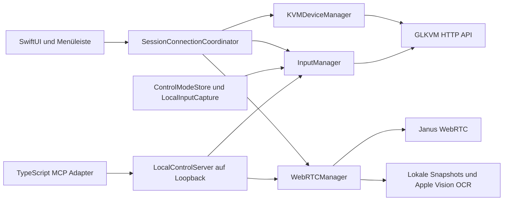

# Overlook: Architektur, Code und Update-Stand

Stand: 2. Oktober 2026. Das Review untersucht den tatsächlich installierten Quellstand, nicht nur den letzten Git-Commit. Der [Arbeitsplan](2026-10-02-overlook-plan.md) beschreibt Umfang, Experten und Abnahmegrenzen.

Nachtrag vom 2. Oktober 2026: Die begrenzten Reparaturen und das MCP-Update sind inzwischen integriert und lokal geprüft. Der [Umsetzungsbericht](2026-10-02-overlook-implementation.md) enthält den aktuellen Stand, die gemeinsame grüne Regression, den separaten WebRTC-154-Versuch und die noch offenen Commit-/Xcode-/Geräteabnahmen. Die folgenden Befunde und Versionsangaben beschreiben den ursprünglichen Reviewstand vor diesen Änderungen. Die installierte App bleibt unverändert.

## Grundlage und Urteil

Die installierte App hat Build-ID `52f2ee6e9506-44a20a59fcb10b78-devsigned`. Der am Anfang des Reviews berechnete Quellfingerabdruck des Arbeitsbaums `work/overlook-session-refactor-2026-09-15` stimmt vollständig mit `OverlookSourceDigest` in der installierten Info.plist überein: `44a20a59fcb10b7894821d9834eb26d6294768241134d4d79acf65ddfc7ac59e`.

Die vorhandene Architektur passt zum Einsatz als native KVM-Konsole mit lokaler Agentensteuerung. Die früheren Probleme mit konkurrierenden Verbindungsversuchen und uneinheitlicher lokaler Eingabefreigabe sind im installierten Stand bereits korrigiert. Ein grundlegender Umbau ist aus diesem Review nicht begründet. Es gibt begrenzte Lifecycle-, Konfigurations- und Performance-Arbeiten, die jeweils separat geprüft werden sollten.

Der Git-Basiscommit `52f2ee6e95066637cfc44fe485beaa88841d3d41` allein reproduziert diese App noch nicht: wesentliche Änderungen und Tests liegen bislang uncommittet vor. Das ist ein reales Wartungs- und Wiederherstellungsproblem. Der Originalarbeitsbaum bleibt während der Reparatur unangetastet; die neue Arbeit liegt im isolierten Branch `codex/overlook-review-2026-10-02`.

## Architektur aus dem Code

- `AppDelegate` komponiert die Komponenten und verbindet Modus-, Session- und Drain-Regeln.
- `SessionConnectionCoordinator` besitzt Verbindungsversuche aus Hauptfenster und Menüleiste. Generationen werden vor Authentifizierung vergeben; veraltete Vorbereitungen können keine neue Session überschreiben. HID-Übergänge und Cleanup werden serialisiert.
- `KVMDeviceManager` übernimmt Discovery, Authentifizierungsvorbereitung, Speicherung sowie Gerätekonfiguration.
- `LocalInputCaptureContext` berücksichtigt Session, Modus, Fokus, Dialoge und eigene Blocker. `InputManager` setzt diese Freigabe um und ordnet HID-Kommandos.
- `WebRTCManager` besitzt Janus-Signaling, Video/Audio, Reconnect, Statistiken und quellgebundene Snapshots.
- `LocalControlServer` stellt authentifizierte TCP-Kommandos ausschließlich auf Loopback bereit. Modusgeneration, Endpoint-/Transport-Abgleich, Mutation-Gate und Action-Ledger begrenzen Agenteneingaben. Ein erfolgreicher Receipt bestätigt Dispatch, nicht gespeicherte Remote-Inhalte.
- Der getrennte TypeScript-Adapter übersetzt MCP über stdio in diesen lokalen TCP-Vertrag.

Codeanker der installierten Grundlage: [AppDelegate](/Users/doebber/Documents/Wago/work/overlook-session-refactor-2026-09-15/Overlook/OverlookApp.swift:29), [Session-Besitzer](/Users/doebber/Documents/Wago/work/overlook-session-refactor-2026-09-15/Overlook/SessionConnectionCoordinator.swift:1), [lokale Eingaberegeln](/Users/doebber/Documents/Wago/work/overlook-session-refactor-2026-09-15/Overlook/LocalInputCapture.swift:1).

## Belegte Maßnahmen

| Priorität | Befund und konkrete Folge | Maßnahme |
|---|---|---|
| P1 | Der installierte stabile Quellstand ist noch nicht vollständig in Git gesichert. Ein Checkout des Basiscommits enthält nicht die laufende App. | Nach Freigabe einen nachvollziehbaren Basis-Commit erstellen; neue Reparatur separat halten. |
| P2 | Headless schaltet den Firmware-Jiggler aus. Beim Wechsel zurück nach Manual wird ein zuvor aktiver Zustand nicht wiederhergestellt. | Sessiongebundene Wiederaufnahme nach Drain; neue manuelle Entscheidung und neue Session gewinnen. |
| P2 | Alte Refresh-Aufträge können trotz Abbruch den aktuellen Jiggler-Zustand löschen; ein transienter erster GET-Fehler hat keine Wiederholung. | Eigene Refresh-Owner und begrenzte GET-Wiederholungen; alte Ergebnisse dürfen nichts veröffentlichen. |
| P2 | `GLKVMSystemConfig` verwirft unbekannte Felder und ersetzt fehlende bekannte Felder durch Defaults. Ein Jiggler-Toggle schreibt anschließend das ganze Objekt. | Firmwarevertrag klären und Konfiguration verlustfrei erhalten. Kein unbestätigter PATCH-Vertrag einführen. |
| P2 | Falls Keychain-Speicherung scheitert, wird der Bearer-Token in `UserDefaults` geschrieben. | Expliziten Speicherfehler melden oder Token nur für die aktuelle Session halten; Migration vorhandener Werte separat und gezielt prüfen. |
| P2 | `authLogin` akzeptiert einen nichtleeren Token oder Cookie auch bei explizitem `ok:false`. Zurückgewiesene Anmeldung erscheint zunächst erfolgreich. | Ablehnung vor Token-/Cookie-Auswertung prüfen. Beide Antwortvarianten gezielt absichern. Dies ist kein nachgewiesener serverseitiger Authentifizierungsbypass. |
| P2 | Ein vorhandenes `mouse_jiggle` mit falschem JSON-Typ wird wie ein nicht unterstütztes Feld behandelt. Headless kann dann die Abschaltprüfung überspringen. | Fehlendes Feld und ungültigen vorhandenen Wert unterscheiden; ungültige Daten als unbekannten Zustand behandeln. Kein Nachweis eines solchen Payloads auf dem aktuellen Gerät. |
| P2 | Für jedes Videoframe wird ein eigener MainActor-Task angelegt. Er hält den Pixelbuffer, bevor OCR drosselt. Bei blockierter Hauptschleife kann die Queue wachsen. | Zuerst unter hoher Auflösung messen; danach höchstens einen ausstehenden Frame übergeben und FPS-Zählung separat erhalten. |
| P2 | `WindowGroup` erlaubt mehrere Fenster, die denselben Video-NSView verwenden. Ein zweites Fenster entfernt ihn aus dem ersten. | Zunächst einen eindeutigen Vertrag für ein Hauptfenster herstellen. Mehrere Renderer nur bei tatsächlichem Bedarf. |
| P2 | Eine lokale Fixture mit gestautem WebSocket-Handshake hängt beim Shutdown nach dem Sendedeadline weiter auf Foundations `send()`-Fortsetzung. | Abschluss des HID-Send-/Shutdown-Pfads unabhängig begrenzen und auf der aktuellen Plattform separat prüfen. Kein Nachweis eines Fehlers im normalen Live-Betrieb. |
| P3 | Statistikantworten des alten Peers werden nach Disconnect/Reconnect ohne Generationsprüfung veröffentlicht. | Peer-/Session-Identität nach jedem Await prüfen; Diagnosewerte der neuen Session schützen. |

Die Performance-Folge ist eine aus dem Code begründete Möglichkeit, keine beobachtete Speicherstörung. Das Review hat weder eine aktuelle Keychain-Störung noch gespeicherte Tokens untersucht. Es wurden keine Zugangsdaten ausgelesen.

Codeanker: [Headless-Deaktivierung](/Users/doebber/Documents/Wago/work/overlook-session-refactor-2026-09-15/Overlook/ContentView.swift:721), [Refresh](/Users/doebber/Documents/Wago/work/overlook-session-refactor-2026-09-15/Overlook/KVMDeviceManager.swift:999), [Config-Decoding](/Users/doebber/Documents/Wago/work/overlook-session-refactor-2026-09-15/Overlook/GLKVMClient.swift:93), [Token-Fallback](/Users/doebber/Documents/Wago/work/overlook-session-refactor-2026-09-15/Overlook/KVMDeviceManager.swift:1050), [Frame-Tasks](/Users/doebber/Documents/Wago/work/overlook-session-refactor-2026-09-15/Overlook/WebRTCManager.swift:1546), [Renderer-Umhängen](/Users/doebber/Documents/Wago/work/overlook-session-refactor-2026-09-15/Overlook/VideoSurfaceView.swift:341), [Statistik-Await](/Users/doebber/Documents/Wago/work/overlook-session-refactor-2026-09-15/Overlook/WebRTCManager.swift:995).

Die beiden abgelehnten Login-Antworten und der verlustbehaftete Konfigurations-Roundtrip wurden zusätzlich mit einem lokalen `URLProtocol` reproduziert: `ok:false` mit synthetischem `result.token` sowie `ok:false` mit synthetischem `auth_token`-Cookie werden akzeptiert; ein unbekanntes Config-Feld verschwindet und ein falsch typisierter bekannter Bool wird durch seinen Default ersetzt. Diese Nachweise verwenden ausschließlich synthetische Antworten und Zugangsdaten. Codeanker: [Login-Vertrag](/Users/doebber/Documents/Wago/work/overlook-session-refactor-2026-09-15/Overlook/GLKVMClient.swift:478). Der genaue serverseitige Effekt des Config-POST bleibt ungeprüft.

Die bestehende TLS-Ausnahme für selbstsignierte KVM-Zertifikate ist in der README dokumentiert. Sie wird als vorhandene Netzwerk-Vertrauensentscheidung behandelt und in dieser Reparatur nicht geändert. Perspektivisch wäre gerätebezogenes Zertifikatsvertrauen sinnvoll; eine ungeprüfte Änderung könnte stabile Verbindungen unterbrechen.

## Fork und Updates

Der offizielle Fork `seamann/Overlook` stammt von `rcawston/Overlook`. Die lokale Basis `52f2ee6...` enthält bereits den Originalstand `2d7ce818...`. Am 2. Oktober zeigt das Original auf `c3f2f24b918c31b7b45309a2442cd4ad79d7e7be`, Release [v1.0.0 vom 7. September 2026](https://github.com/rcawston/Overlook/releases/tag/v1.0.0).

Seit dem enthaltenen Originalstand kam genau ein [Release-Commit](https://github.com/rcawston/Overlook/commit/c3f2f24b918c31b7b45309a2442cd4ad79d7e7be): Veröffentlichungsworkflow, ExportOptions, README-Korrektur und Bundle-ID-Wechsel. Er enthält keine neue KVM-, Jiggler- oder WebRTC-Funktion. Ein direktes Merge bringt daher für den Betrieb keinen erkennbaren Nutzen. Der Wechsel von `com.overlook.app` zu `com.rcawston.Overlook` kann Einstellungen und macOS-Berechtigungen beeinflussen. Bei Bedarf kann man den Release-Workflow gezielt mit der eigenen stabilen App-Identität portieren.

Ein Jiggler-Fix zum Übernehmen wurde in der öffentlichen Upstream-Historie nicht gefunden. Die erweiterte Jiggler-UI und Lifecycle-Logik sind lokale Entwicklung. Der historische [Relative-Mouse-Fix in Issue 2](https://github.com/rcawston/Overlook/issues/2) ist bereits im gemeinsamen Vorfahren enthalten.

| Abhängigkeit | Lokaler Stand | Live geprüfter aktueller Stand | Empfehlung |
|---|---|---|---|
| WebRTC | 109.0.1, Januar 2023 | 154.0.0, 30. September 2026 | Eigener experimenteller Branch mit Build und vollständiger GLKVM-Abnahme. |
| MCP server/client | 2.0.0 | 2.2.0 | Sinnvollster kleiner Update-Kandidat; Server und Client gemeinsam aktualisieren und alle stdio-/Cancellation-/Action-Tests prüfen. |
| Zod | 4.4.3 | 4.6.5 | Separat nach MCP prüfen. |
| TypeScript | 7.0.2 | 7.0.2 | Kein Update erforderlich. |
| Node-Typen | 26.2.0 | 26.6.4 | Kleine separate Wartungsänderung. |

WebRTC liegt 45 Chromium-Meilensteine zurück; eine ausdrückliche Abkündigung der alten Version wurde nicht gefunden. Overlook nutzt tiefe native Audio-/Objective-C-APIs. Ein Versionssprung darf deshalb nicht mit dem Jiggler-Fix vermischt werden. Quellen: [WebRTC 109.0.1](https://github.com/stasel/WebRTC/releases/tag/109.0.1), [WebRTC 154.0.0](https://github.com/stasel/WebRTC/releases/tag/154.0.0).

MCP [2.1.0](https://github.com/modelcontextprotocol/typescript-sdk/releases/tag/%40modelcontextprotocol%2Fserver%402.1.0) korrigiert unter anderem stdio-Abschluss bei stdin-EOF und Cancellation mit ID 0. [2.2.0](https://github.com/modelcontextprotocol/typescript-sdk/releases/tag/%40modelcontextprotocol%2Fserver%402.2.0) ergänzt Korrekturen für geschlossene Verbindungen und unhandled rejections. Das ist für den direkt verwendeten `serveStdio`-Einstieg relevant.

Die Recherche begann mit `ai-browser`; wegen `browser_error` auf GitHub wurden danach primäre GitHub-API-/Git-Remote-Abfragen und die npm Registry verwendet. Es wurden weder Browser-Profile noch authentifizierte Fremdsysteme bedient.

## Bereits verifizierte Baseline

- Installierte Metadaten und aktueller vollständiger Build-Quellfingerabdruck stimmen überein.
- 99 Quell-/Testdateien für die isolierte Arbeit kopiert und gehasht; Originalstand unverändert.
- MCP: 62 Tests bestanden.
- `npm audit`: keine bekannten Schwachstellen für den aktuellen Lockfile.
- Swift: Kontrollmodus, Policies, HTTP-Response-Vertrag, Remote-Actions, SessionCoordinator und Input/HID-Tests erfolgreich. Zusätzlich bestehen 17 Snapshot-Fälle, 8 ControlServer-Integrationsgruppen und die WebSocket-Readiness-Prüfungen.
- Die unveränderte WebSocket-Settlement-Suite hängt reproduzierbar bereits in der ersten Gruppe `testShutdownDoesNotReconnect`. Die eigene Loopback-Fixture bestätigt den abgebrochenen Handshake nach ungefähr drei Sekunden, aber bis zur externen 30-Sekunden-Grenze keinen abgeschlossenen Shutdown. Historische Logs vom 15. September zeigen sechs bestandene Gruppen. Auf der aktuellen Plattform besteht daher keine vollständige grüne Swift-Abnahme; ein Betriebssystem-/Toolchain-Einfluss ist plausibel und nicht abschließend bewiesen.

Der normale Xcode-Aufruf meldet eine nicht akzeptierte Lizenz. Lokale Tests verwenden den vorhandenen Command-Line-Tools-Compiler mit explizitem SDK und macOS-14-Target. Bestehende Concurrency-Warnungen bei Swift-6-Sprachmodus sind zusätzliches Migrationsthema; das Projekt verwendet Swift-5-Modus.

Der Hänger liegt außerhalb der Jiggler-Reparatur. Codeanker: [wartender HID-Send](/Users/doebber/Documents/Wago/work/overlook-session-refactor-2026-09-15/Overlook/GLKVMClient.swift:1265), [Shutdown-Drain](/Users/doebber/Documents/Wago/work/overlook-session-refactor-2026-09-15/Overlook/InputManager.swift:1211). [Begrenzter neuer Nachweis](/Users/doebber/.codex/artifacts/overlook-review-2026-10-02/baseline-remainder/settlement-bounded.log).

Release-Build, Signierung, Installation und Live-KVM-Abnahme sind gesonderte Nachweise. Die laufende App wurde durch dieses Review nicht geändert. Ein Bool-Readback bestätigt die Firmwareeinstellung, nicht das tatsächliche Wachhalten des entfernten Bildschirms.

## Vorbereitete Jiggler-Reparatur

Die Umsetzung liegt im isolierten Arbeitsbaum und ist zusätzlich als [Patch gegen die exakt nachgewiesene Grundlage](2026-10-02-overlook-jiggler.patch) mit [Dateiprüfsummen](2026-10-02-overlook-jiggler-files.json) exportiert. `git apply --check` besteht auf dem unveränderten stabilen Originalarbeitsbaum; dort wurde der Patch nicht angewendet.

- Ein zuvor aktiver Firmware-Jiggler wird sessiongebunden gemerkt und nach Headless wiederhergestellt. Ein zuvor ausgeschalteter bleibt ausgeschaltet.
- Vorherige Remote-Eingaben werden vollständig abgearbeitet. Danach ist Manual sofort wieder bedienbar; die Firmware-Wiederherstellung läuft anschließend und hält die lokalen Eingaben nicht zurück.
- Neue manuelle Entscheidungen, Sessionwechsel und veraltete Antworten verlieren alte Wiederherstellungsaufträge. Bereits gesendete Enable-Aufträge bei neuer Headless-Transition werden im gehaltenen Konfigurations-Gate mit geprüftem Abschalten abgewickelt.
- Ein Refresh besitzt einen eigenen Owner und Konfigurationsgeneration. Abbruch oder alte Antworten überschreiben keinen neueren Zustand. Rein lesende Abrufe erhalten höchstens drei Versuche; Authentifizierungsfehler und nicht unterstützte Firmware werden nicht wiederholt.
- Fehler bei der Wiederherstellung werden in der Oberfläche sichtbar. Es gibt keine neue Bewegungsschleife und keine pauschale Aktivierung beim Verbinden.

TDD-Nachweise: Zuerst scheiterten die Verhaltenstests am bisherigen Ablauf. Zusätzlich scheiterte ein Test der Manual-Reaktionszeit an der ersten Reparaturfassung; der unabhängige Review führte zur Entkopplung der Firmware-Wartezeit. Die endgültigen 22 Lifecycle-Szenarien bestehen, einschließlich tatsächlicher `ControlModeStore`-Cancellation sowie freigegebener Manual-Eingabe bei blockierter POST-Antwort. Drei aufeinanderfolgende Läufe: 66/66 Fälle bestanden. Ein unabhängiger Reviewer kompilierte und bestätigte die 22 Szenarien und die vorhandenen Kontrollmodustests. Keine offenen blockierenden Befunde im begrenzten Reparatur-Diff.

Gemessene Abdeckung ausschließlich der geänderten Jiggler-Lifecycle-/Safety-/Refresh-Methoden und zugehörigen Modusmethoden: 278/300 ausführbare Zeilen (92,67 %), 134/159 LLVM-Regionen (84,28 %) und 24/25 Funktionen (96 %). LLVM liefert hier keine Branch-Zähler; Regionen werden nicht als Branch-Coverage ausgegeben. Die Gesamtabdeckung der App wurde nicht gemessen. [Messübersicht](/Users/doebber/.codex/artifacts/overlook-review-2026-10-02/jiggler-coverage-summary.json).

Zusätzliche Prüfungen: bestehende Kontrollmodus-/Reliability-Tests, Shell-Syntax und `git diff --check` bestanden. Der erste Whole-App-Typecheck mit dem installierten Runtime-Framework scheiterte an fehlenden Entwicklungsheaders. Die Prüfung mit dem vollständigen archivierten WebRTC-Entwicklungsframework und dem vorhandenen SDK 26.5 erfasst alle 28 Swift-Dateien, endet aber an einem fehlenden `PreviewsMacros`-Plugin für den bereits in der Baseline vorhandenen `#Preview`. Es gibt keine Compilerdiagnose in der neuen Jiggler-Logik. Der gesamte Typecheck ist dennoch nicht bestanden; ein regulärer signierter Release-Build steht aus. [Typecheck-Protokoll](/Users/doebber/.codex/artifacts/overlook-review-2026-10-02/whole-app-typecheck-sdk26_5.log).

Wolfgang hat die getrennte lokale Sicherung von stabiler Basis und Reparatur ausdrücklich freigegeben. Der ECC-Pre-Commit-Scan blockiert die exakte Basis jedoch wegen sieben synthetischer Token-/Passwort-Testtreffern in vier vorhandenen MCP-Testdateien. Ein unabhängiger Security-Reviewer hat den exakten Staging-Index mit allen sechs Hookmustern geprüft: ausschließlich feste Sentinelwerte für Redaktionsprüfungen, keine echten Zugangsdaten. Der aktive Hook hat keine wert- oder zeilenbezogene Allowlist. Die gesonderte Freigabe für eine einmalige Hook-Ausnahme steht noch aus; bislang wurde kein neuer Commit erstellt.

Die vollständige unveränderte Grundlage ist zusätzlich als [Basisarchiv](/Users/doebber/.codex/artifacts/overlook-review-2026-10-02/stable-baseline-source.tar.gz) mit 99 nachgeprüften Dateien gesichert. Archiv-SHA-256: `e80be71d47578758c5558d442ad4092cd54ff4cdfdfa509a8e1fb5f91d8de1ce`. Der finale [Erhaltungsnachweis](/Users/doebber/.codex/artifacts/overlook-review-2026-10-02/final-preservation-proof.json) bestätigt erneut den identischen Build-Quellfingerabdruck und die unveränderte installierte ausführbare Datei. Der Originalarbeitsbaum und die installierte Anwendung bleiben erhalten.
